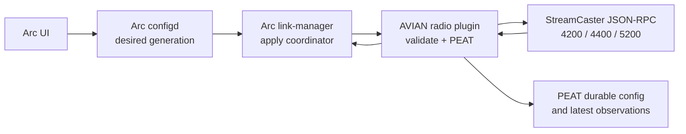

# Arc 4000 Series radio plugin

## Ownership

Arc owns desired radio configuration. AVIAN supplies a PEAT-backed radio
integration layer around that authority:



The plugin never writes the canonical Arc configuration and never talks to a
flight controller. PEAT distributes the accepted Arc generation and radio
observations; it does not become a competing configuration authority.

## Current executable and live inventory

`arc-radio-plugin` supports both a local JSON stdin/file compatibility tool and
an ARC sidecar. The compatibility tool still validates legacy grouped planning
documents, but groups, percentages, average spacing, and generated topology are
not operational inventory.

In `--serve` mode the sidecar polls its configured radio with the documented
read-only `supported_frequency_profiles` and `print_all_settings` calls every
five seconds. It publishes a versioned observation containing:

- the real local management IP, stripped of credentials and URL paths;
- the effective radio node ID, system name, network ID, frequency, bandwidth,
  antenna mask, transmit power, firmware, and model when the radio reports them;
- the local PEAT endpoint and actual connected-peer count; and
- configured PEAT peer addresses with a live connected/disconnected state; and
- the current fused ARC `local/telemetry` position when it is no more than 30
  seconds old. Raw GPS is not substituted for missing fused position data.

Each sidecar stores one stable, latest-value PEAT telemetry record for its own
observation. PEAT synchronizes those records across the formation, and the
sidecar republishes synchronized records onto its local Zenoh session. The
ground-side view can therefore aggregate actual reports without inventing node
counts, positions, spacing, or radio links.

Local effective-radio observations and fleet mesh observations use separate
Zenoh topics. Only the local five-second radio read can refresh ARC bearer
health; a synchronized observation from another node cannot make the local
bearer appear present.

ARC Link Manager aggregates fresh observations for 30 seconds and exposes them
through dev-bridge at `GET /api/radio/streamcaster/mesh`. Zero observed nodes is
valid. The response carries `capacity_requirement_nodes: 150` and
`capacity_verification: not_yet_field_verified`; it never claims that the
currently observed node count proves the capacity requirement.

The offline [radio mesh bootstrap command](arc-radio-bootstrap.md) derives
stable PEAT endpoint IDs from the protected formation key and inventory node
names, then emits a reviewed, bounded peer map plus ARC Ansible host variables.
It never scans the network, deploys a surrogate, or writes a radio.

The compatibility tool:

1. validates the Arc-owned network and grouped fleet configuration;
2. expands percentage groups into deterministic per-node assignments;
3. computes the 3 KiB routine load and assesses a single-source 5.5 MB
   priority transfer to a 4000-series control station;
4. enforces an 80% maximum airtime planning ceiling and reports the
   even-share gateway ingress floor;
5. wraps the accepted configuration as a durable PEAT mission record; and
6. emits a dry-run StreamCaster JSON-RPC apply template.

```sh
cargo run -p arc-radio-plugin -- \
  --input examples/arc-radio-plugin-request.sample.json
```

The 150-node figure is a network capacity requirement, not a minimum active
population. Small live networks and single-radio benches are valid. Capacity
must be demonstrated separately with representative hardware and traffic; it
is not inferred from inventory size or Ethernet link speed.

## Manual-grounded rules

The implementation encodes these StreamCaster 5.0 behaviors from the supplied
4000-series user manual v5.0.1.12 and API manual v5.0.1.5:

- radios mesh only when center frequency, bandwidth, network ID, and link
  distance agree;
- link distance is planned at 115% of maximum separation (within the manual's
  recommended 10-15% margin) and is synchronized network-wide;
- 4200/4400 and documented SL5200 profiles can plan 5, 10, or 20 MHz, while
  narrow widths are option/capability dependent; SL4200 is limited to
  1.25/2.5/5 MHz in the documented profile;
- frequency and bandwidth changes soft-boot radio services, so the generated
  sequence includes a reconnect barrier;
- `freq_bw` is used for an atomic change, while persistence uses the individual
  `freq` and `bw` values because `freq_bw` cannot be passed to
  `setenvlinsingle`;
- all hardware applies begin by reading `supported_frequency_profiles` and end
  by comparing `print_all_settings` with the Arc desired generation; and
- routing beacon overhead grows with node count, so the default sample uses a
  500 ms beacon period rather than the 100 ms minimum.

The SL5200 OEM v1.1 integration profile adds exact SL5205, SL5210, and SL5220
identities plus confirmed dimensions, mass, 9–32 V input, missing reverse
polarity protection, power-consumption envelopes, and thermal limits. The
`fcc_sl52_245_oem` regulatory profile can be selected only for an exact SL5210
or SL5220 model listed by the grant. It permits 10 MHz from 2416–2457 MHz and
20 MHz at 2440 MHz only, with respective 24 and 27 dBm per-port conducted-power
caps. Generic and estimated 5200 profiles remain capability-only. These limits
constrain planning; the radio's live capability response and the operator's
authorization still constrain hardware apply.

Published peak data rate is never treated as usable mission capacity. Each
radio/antenna/airframe/environment group can carry a field-calibrated UDP
capacity; otherwise the assessment warns that capacity is unknown.

The priority payload is 5,500,000 bytes, or 44,000,000 bits. The remaining
20% airtime is reserved for routing, control, retransmissions, and other mesh
traffic. Transfer time remains unknown until end-to-end UDP goodput is measured
from the source, through the operational route, to the control station. When
that measurement is supplied, the planner applies the airtime ceiling,
subtracts routine offered load, and reports a planning-only transfer time.

The current operator-supplied installed-system estimates are 34.44 dBm EIRP
airborne and 33 dBm EIRP ground. They are retained as approximate planning
inputs, not regulatory authorization or calibrated installation evidence. For
one transmit path, the relation is `EIRP dBm = conducted transmit power dBm +
antenna gain dBi - cable and connector losses dB`. MIMO/beamforming compliance
must use the vendor and regulatory method for the actual array; port powers
must not simply be added. The airtime ceiling limits channel occupation, not
instantaneous EIRP.

## Security and hardware gate

PEAT records intentionally omit credentials and cryptographic keys. The
eventual hardware executor must receive secrets from local Arc-managed secret
storage, use the password-authenticated API session, refresh the expiring
cookie, serialize disruptive calls, and re-read effective state after every
reconnect.

This branch does not send commands to real radios. Live discovery is read-only.
Hardware apply remains
gated on representative 4200, 4400, and 5200 units, live capability captures,
and radio-in-the-loop tests.
