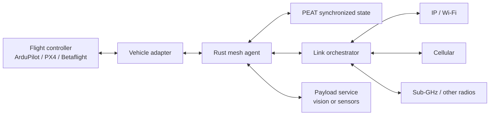

# AVIAN v0.1 architecture

## Design objective

The mesh must continue operating when the ground station disappears, any
aircraft crashes, or connected groups become temporarily partitioned. No node
owns unique operational state and no permanent leader is assumed.

The mesh agent is the only process that handles mesh identity, command
verification, state synchronization, and transport policy. Vision and other
payload services are isolated local processes so their failure cannot take
down telemetry or emergency control.

## Node roles

Roles describe capabilities, not authority:

- ArduPilot and PX4 aircraft advertise telemetry, mission navigation,
  emergency control, relay, and optional payload capabilities.
- Betaflight aircraft advertise telemetry, emergency control, and relay. They
  never advertise autonomous mission navigation.
- Ground and cloud nodes are regular peers. Losing them does not invalidate
  state held by aircraft.
- Relay responsibility is selected dynamically from current connectivity and
  resources. It is not a permanent leadership role.

## Data paths

| Data | Behavior |
| --- | --- |
| Emergency command and acknowledgement | Signed, short-lived, replay-protected, sent redundantly |
| Mission intent and detections | Durable PEAT state; reconciled after partitions |
| Position and health telemetry | Latest-value, short-lived, rate-adjusted under congestion |
| Images and logs | Durable, resumable, opportunistic |
| Video | Separate streaming path; never placed in the CRDT state document |

## Altitude model

The system-wide ceiling is 25,000 ft MSL (7,620 m). Messages retain three
different measurements rather than treating them as interchangeable:

- `msl_m`: altitude above mean sea level; used for the system ceiling.
- `agl_m`: estimated height over terrain; used for terrain and RF geometry.
- `above_launch_m`: displacement from the launch reference.

Every aircraft can advertise a lower platform ceiling. The task allocator must
honor the lower of the system and platform ceilings.

Link scoring combines measured latency, loss, goodput, signal quality,
stability, energy cost, estimated line of sight, and Fresnel clearance. A high
altitude never makes a link healthy by itself.

## PEAT boundary

`mesh-peat` maps delivery classes into PEAT `MessageRequirements`, builds the
PACE transport policy, persists versioned AVIAN records in Automerge, and
synchronizes them through Iroh QUIC. Telemetry uses PEAT's `telemetry`
collection and therefore inherits its LatestOnly synchronization mode;
commands retain full history. Peers authenticate with a shared formation key,
and each endpoint identity is stable across restarts because it is derived
from the formation secret and unique node name. Public Iroh relays are
disabled; initial peers are currently supplied as endpoint/address pairs.

The UAV link orchestrator remains responsible for altitude-aware scoring,
hysteresis, path changes, and per-message redundancy because those are
application-specific decisions. PEAT synchronization is independent of any
ground or cloud peer.

## Failure model

The first simulation validates:

1. Aircraft receive a mission while connected to the ground node.
2. The ground node is partitioned and the aircraft continue sharing telemetry.
3. One aircraft crashes without halting the remaining component.
4. A degraded primary transport is replaced by a healthier path.
5. The ground node reconnects and sends a signed Betaflight emergency command.
6. A recovered aircraft converges to the current mission and telemetry state.
